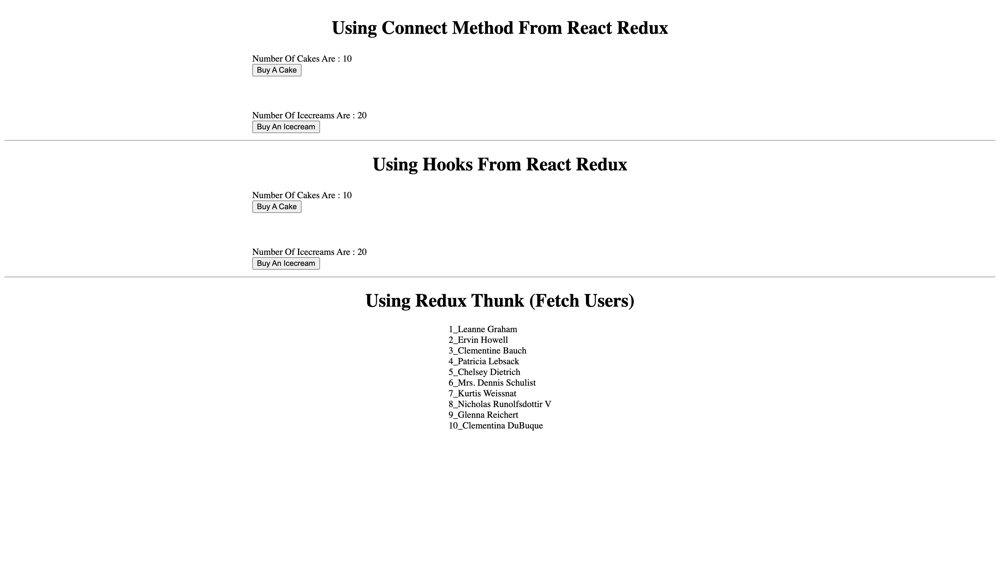

# ⚛️ React Redux Integration (Standard Pattern)

## 📚 Redux Mastery Series Navigation

| Part | Topic | Tech Stack | Link |
| :---: | :--- | :--- | :---: |
| **01** | **Redux Core** | Vanilla JS, Store, Actions | [View Repo](https://github.com/HossamGezo/01-redux-vanilla-core) |
| **02** | **React Redux** | React, Connect, Hooks, Thunk | 👉 **You are here** |
| **03** | **Redux Toolkit** | RTK, TypeScript, createAsyncThunk | [View Repo](https://github.com/HossamGezo/03-redux-toolkit-typescript) |

---

> **Part 2** of the Redux Mastery Series.

[](https://app.netlify.com/projects/redux-legacy-js-demo/deploys)
[](https://6943f8962925601bae09c57f--redux-legacy-js-demo.netlify.app/)

This repository demonstrates how to integrate **Redux (Standard Version)** with a **React** application. It covers multiple patterns including the legacy `connect` HOC, modern `Hooks` (useSelector/useDispatch), and asynchronous logic using `Redux Thunk`.

<br />



---

## ⚠️ CRITICAL: Version Compatibility & Installation

To ensure this project runs correctly and matches the standard learning curriculum, **specific legacy versions** of packages are used. Modern versions (like Redux Toolkit or React 19) may break the logic implemented here.

### 📦 Core Dependencies Versions:
- **React:** `^18.2.0` (Do not use React 19)
- **Redux:** `^4.2.0`
- **React-Redux:** `^8.0.5`
- **Redux-Thunk:** `^2.4.2`

### 🛠️ How to Install (VERY IMPORTANT)
When installing dependencies for this project, you **MUST** use the `--legacy-peer-deps` flag to prevent version conflicts with modern NPM standards.

```bash
# Run this command to install dependencies:
npm install --legacy-peer-deps
```

---

## 🚀 Features Implemented

### 1. Cake Shop (The `connect` Pattern)
- Demonstrates the old way of connecting React components to Redux.
- Uses `mapStateToProps` and `mapDispatchToProps`.
- Located in: `src/components/redux-connect/`

### 2. Ice Cream Shop (The `Hooks` Pattern)
- Demonstrates the modern, cleaner way using React Redux Hooks.
- Uses `useSelector` to access state.
- Uses `useDispatch` to trigger actions.
- Located in: `src/components/redux-hooks/`

### 3. Async Users List (Redux Thunk)
- Demonstrates handling asynchronous API calls (Fetching Data).
- Manages 3 states: `Loading`, `Success (Data)`, and `Failure (Error)`.
- Uses `redux-thunk` middleware.
- Located in: `src/components/redux-thunk/`

---

## 📂 Project Structure

```text
src/
├── components/
│   ├── redux-connect/    # Legacy Connect Containers
│   ├── redux-hooks/      # Modern Hooks Containers
│   └── redux-thunk/      # Async Logic Containers
├── redux/
│   ├── cake/             # Cake Actions & Reducers
│   ├── icecream/         # Ice Cream Actions & Reducers
│   ├── user/             # User Async Actions & Reducers
│   ├── rootReducer.js    # Combining all reducers
│   └── store.js          # Store configuration with Middleware
├── App.jsx               # Main Layout
└── main.jsx              # App Entry (Provider Setup)
```

---

## 🏃‍♂️ How to Run

1.  **Clone the repository.**
2.  **Install dependencies** (Don't forget the flag!):
    ```bash
    npm install --legacy-peer-deps
    ```
3.  **Start the development server:**
    ```bash
    npm run dev
    ```

---

## 👨‍💻 Author

**Hossam**
- GitHub: [@HossamGezo](https://github.com/HossamGezo)

---

## 📝 License
This project is for educational purposes to master the core concepts of Redux before moving to Redux Toolkit.
```